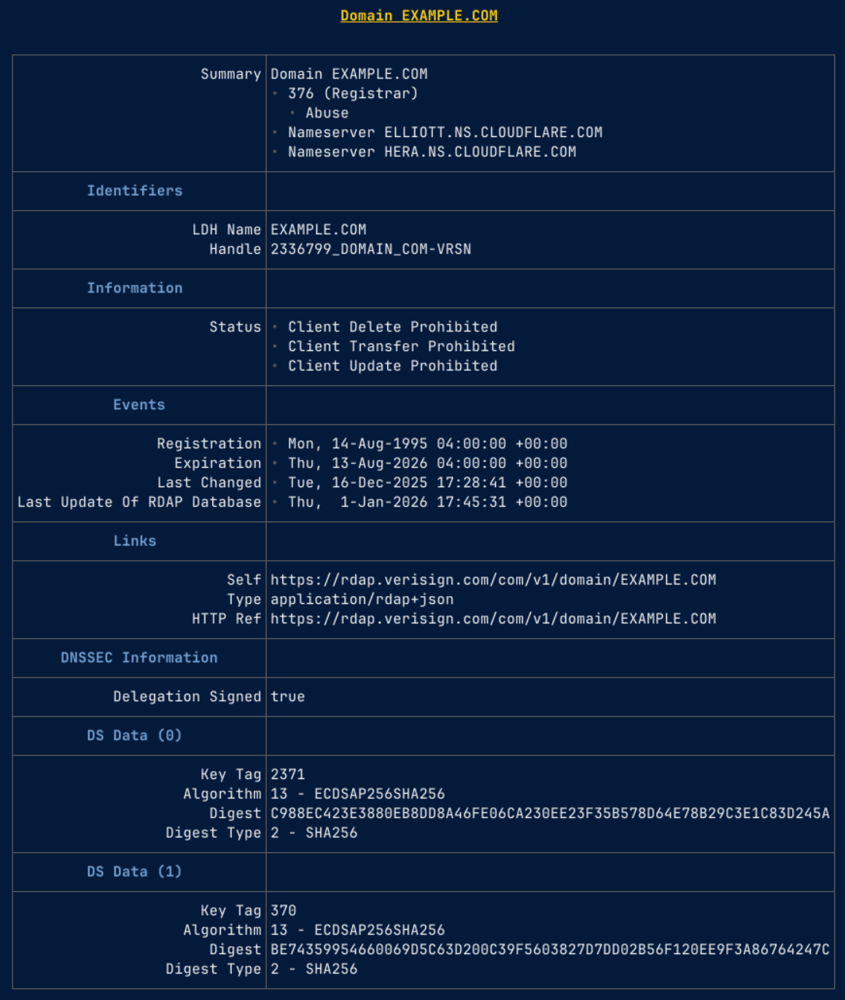
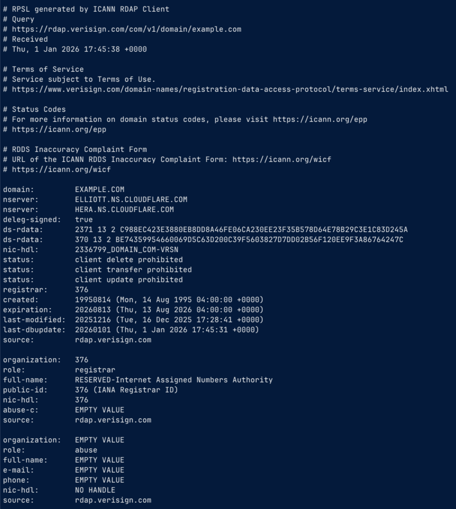

# The `rdap` Command

The `rdap` command is an easy-to-use, full-featured, command-line interface (CLI) client for RDAP.
It supports RDAP bootstrapping, caching, different output formats, link following, and the following extensions:

* Cidr0
* JSContact
* Redacted
* SimpleRedaction

<figure markdown="span">
  
  <figcaption>Example Rendered Markdown Output</figcaption>
</figure>

<figure markdown="span">
  
  <figcaption>Example RPSL Output</figcaption>
</figure>
