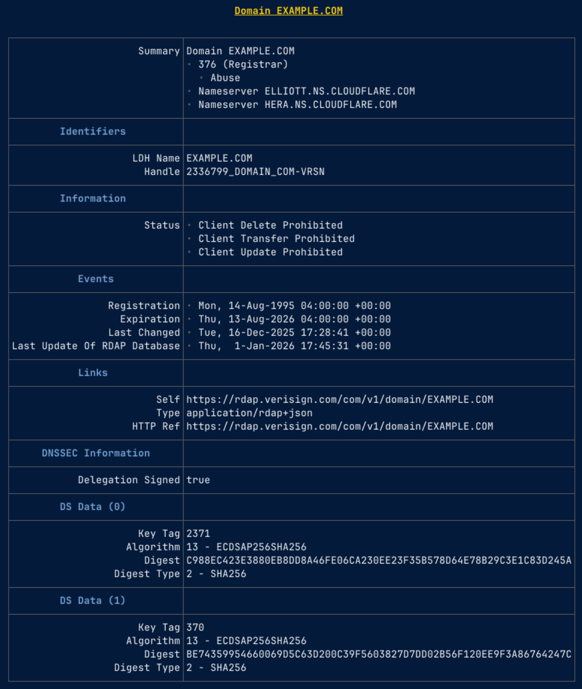
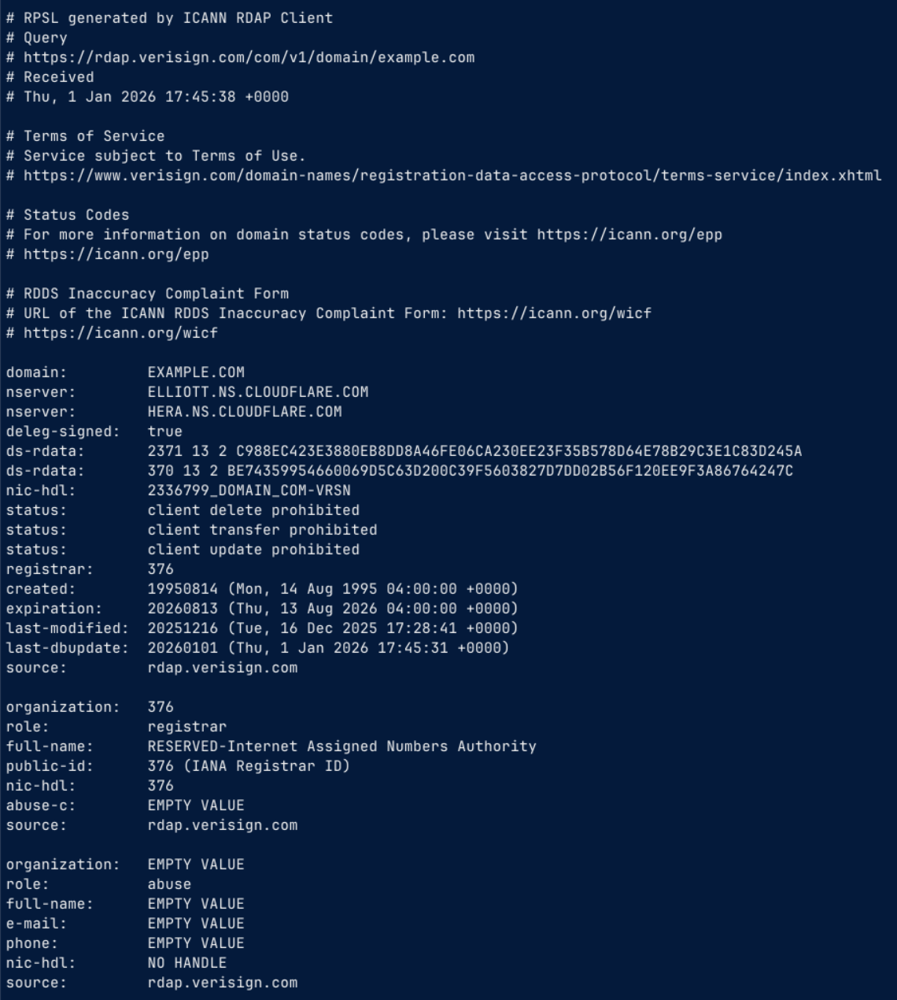

# The `rdap` Command

## Quick Start

### Basic Queries

* [Domain](domain_queries.md): `rdap example.com`
* [TLD](domain_queries.md#tld-queries): `rdap .com`
* [IP Address](ip_queries.md): `rdap 192.0.2.1`
* [CIDR](ip_queries.md#cidr-block-queries): `rdap 10/8`
* [RIR Search](rir_searches.md): `rdap up:192.0.2.1`
* [ASN](autnum_queries.md): `rdap as64496`
* [GeoFeed](geofeeds.md): `rdap -O geofeed 81.93.181.144`
* URL: `rdap https://rdap.iana.org/domain/com`

### Command Help

* brief: `rdap -h`
* extended: `rdap --help`

### Querying Specific Servers

* Using registered servers: `rdap -b arin GOOGL` ( _note: [all the RIRs are registered](ip_queries.md#server-targeting-options)_ )
* Using base URLs: `rdap -B https://rdap.arin.net/registry GOOGL`
* Using full URLs: `rdap https://rdap.arin.net/registry/entity/GOOGL`

## About

The `rdap` command is an easy-to-use, full-featured, command-line interface (CLI) client for RDAP.
It supports RDAP [bootstrapping](bootstrapping.md), [caching](usage.md#caching), different [output formats](output_formats.md),
[link following](link_targets.md), [filtering](filters.md), and features useful for [scripting](scripting.md).

The following extensions:

* Cidr0
* Exts
* Geofeed
* JSContact
* Redacted
* RirSearch1
* SimpleRedaction
* Ttl0

<figure markdown="span">
  
  <figcaption>Example Rendered Markdown Output</figcaption>
</figure>

<figure markdown="span">
  
  <figcaption>Example RPSL Output</figcaption>
</figure>
