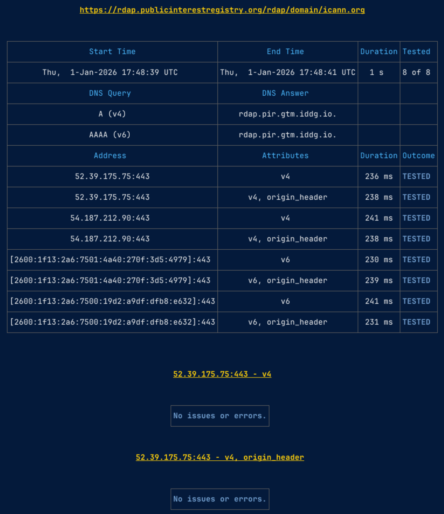

# The `rdap-test` Command

The `rdap-test` command is a command-line interface (CLI) testing utility. The purpose of this command is to help
RDAP service operators improve their services. This command does not cover all issues with RDAP and is intended as
yet another tool to help improve RDAP. This command is not a substitute for more comprehensive tools such the
[ICANN RDAP Conformance Tool](https://github.com/icann/rdap-conformance-tool).

The `rdap-test` command can directly output JSON and has a set of exit codes making it easy to integrate into CI/CD pipelines
and other software development practices. This command can also use RDAP bootstrapping, including referral chasing, enabling
the tests for finding of authoritative RDAP services.

<figure markdown="span">
  
  <figcaption>Example Rendered Markdown Output</figcaption>
</figure>

