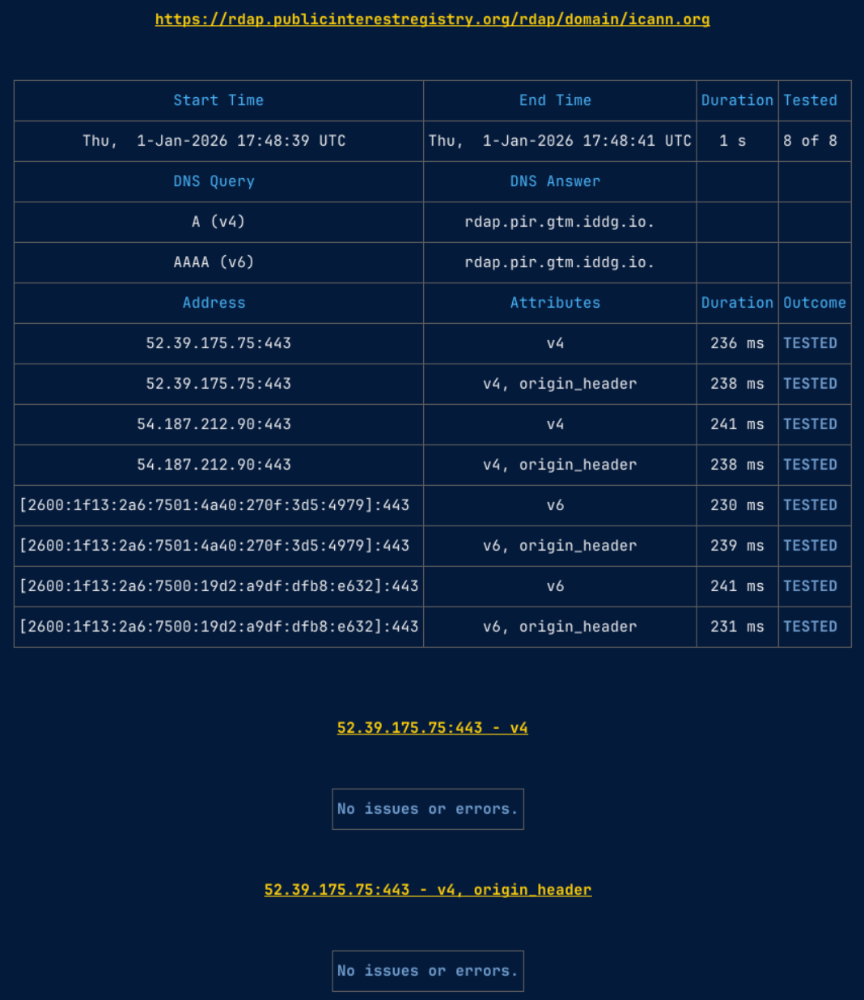

# The `rdap-test` Command

The `rdap-test` command is a command-line interface (CLI) testing utility. The purpose of this command is to help
RDAP service operators improve their services. This command does not cover all issues with RDAP and is intended as
yet another tool to help improve RDAP. This command is not a substitute for more comprehensive tools such the
[ICANN RDAP Conformance Tool](https://github.com/icann/rdap-conformance-tool).

The `rdap-test` command can directly output JSON and has a set of exit codes making it easy to integrate into CI/CD pipelines
and other software development practices. This command can also use RDAP bootstrapping, including referral chasing, enabling
the tests for finding of authoritative RDAP services.

```
https://rdap.apnic.net/ip/106.0.0.1
===================================
Summary
---
  Start Time:    Thu,  6-Aug-2026 00:24:25 UTC
  End Time:      Thu,  6-Aug-2026 00:24:25 UTC
  Duration:      0 s
  Tested:        12 of 12

DNS Data
---
  A (v4):    rdap.apnic.net.cdn.cloudflare.net.
  AAAA (v6): rdap.apnic.net.cdn.cloudflare.net.

Test Runs
---
  Address                              Attributes               Duration   Outcome
  104.18.235.68:443                    v4                       103 ms     TESTED
  104.18.235.68:443                    v4, origin_header        67 ms      TESTED
  104.18.235.68:443                    v4, exts_list            49 ms      TESTED
  104.18.236.68:443                    v4                       51 ms      TESTED
  104.18.236.68:443                    v4, origin_header        50 ms      TESTED
  104.18.236.68:443                    v4, exts_list            45 ms      TESTED
  [2606:4700::6812:ec44]:443           v6                       48 ms      TESTED
  [2606:4700::6812:ec44]:443           v6, origin_header        61 ms      TESTED
  [2606:4700::6812:ec44]:443           v6, exts_list            42 ms      TESTED
  [2606:4700::6812:eb44]:443           v6                       51 ms      TESTED
  [2606:4700::6812:eb44]:443           v6, origin_header        50 ms      TESTED
  [2606:4700::6812:eb44]:443           v6, exts_list            44 ms      TESTED

104.18.235.68:443 - v4
----------------------
  [ROOT]/ip_network                       : Std95Warn:(1800) Use of access-control-allow-origin is recommended.
  [ROOT]/ip_network/rdap_conformance      : Std95Warn:(0102) declared extension may not be registered.

104.18.235.68:443 - v4, origin_header
-------------------------------------
  [ROOT]/ip_network/rdap_conformance      : Std95Warn:(0102) declared extension may not be registered.  
```
<center><em>Example text output</em></center>

<figure markdown="span">
  
  <figcaption>Example Rendered Markdown Output</figcaption>
</figure>

